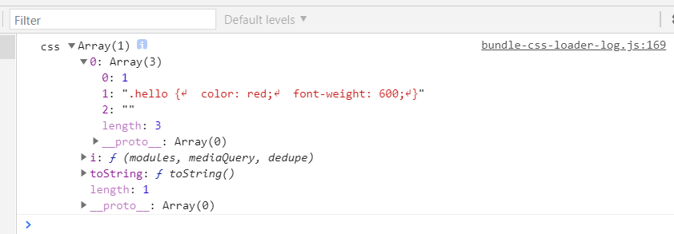

# CSS 样式处理

1. 原生 css 在 html 中挂载的形式
1. css-loader 将 css 内容以字符串形式插入数组，转为 webpack 可识别的 js 模块
1. style-loader 将数组中 css 内容提取出来，以 `style` 标签的形式注入到html 中
1. miniCssExtractPlugin 将数组中的 css 内容提取出来，以 `<link rel="stylesheet" href="">` 标签形式注入到 html 中
1. 异步 css 的 chunk 提取和命名
1. 将多个 css chunk 合并到一个文件中
1.  css-minimizer-webpack-plugin 压缩 css
1. pureCss 去除 css 死代码
1. css 预处理器配置

## CSS 原生处理的四种方式

HTML 文件中插入 CSS 有四种方式：
- 内联样式，也称为行内样式
- 内嵌样式，即通过 `<style></style>` 元素写入样式
- 链接外部样式，即通过 `<link rel="stylesheet" href="">` 元素链接到单独的 css 文件。
- `@import` 导入样式

```html
<!-- 1. 行内样式 -->
<div class="greet" style="color:orange;font-size:18px">Hello CSS</div>

<!-- 2. 内嵌样式 -->
<head>
  <style>
    .greet {
       color: orange;
      font-size: 18px;
    }
  </style>
  <!-- 但是一般直接不直接使用media，而是使用@media，可以避免文档中多个style元素 -->
  <style media="screen and (min-width: 600px)">
    .greet {
      color: red;
    }
  </style>
</head>

<!-- 3. 链接样式 -->
<head>
  <link rel="stylesheet" href="./greet.css">
  <link rel="stylesheet" href="desktop.css" media="screen and (min-width: 600px)"> <!-- 指定媒体查询 -->
</head>

<!-- 4. @import 导入样式 -->
<head>
  <style>
    /* 以下3种方式都有效：
        1. 当使用url(url)的方式时，包住路径的引号可有可无；
        2. 当直接使用url时，包住路径的引号必须保留。
        3. 必须在 CSS 样式表头部最先声明。
        4. 其后的分号是必需的，如果省略了此分号，外部样式表将无法正确导入，并会生成错误信息。
    */
    @import url('./greet.css');
    @import url(./greet.css);
    @import './greet.css';

    /* 也支持指定导入的样式用于那种生效的媒体查询 */
    @import url(example.css) screen and (min-device-width:500px) and (max-device-width:1024px);
  </style>
</head>
```
## webapck 打包 css

在 webpack 世界中，可以视一切皆模块。

代码中以下使用以下语句导入的文件都会被视为模块进行处理：
- ES module 规范中的 `import xx from xx` 语句和动态导入语句 `import()`
- CommonJS 规范的 `require()` 语句
- AMD `define / require` 语句
- css/sass/less 文件中的 `@import` 语句。
- css 样式属性值中的 `url(...)`
- HTML 文件``中的图片链接(image url)

但是 webpack 默认只处理 `.js` 格式的文件，所以对`.css`样式文件，需要配置一个特殊的模块预处理器 `loader` 来将 css 文件转为 js 文件。这样 webpack 就可以进行后续的打包、提取、压缩等插件的操作。

```css
/* index.css */
.hello {
  color: red;
  font-weight: 600;
}
```
```js
// index.js
import './index.css' // 直接导入 css 文件

function genElement() {
  const eleDiv = document.createElement('div')
  eleDiv.textContent = 'Hello webpack css'
  eleDiv.classList.add('hello') // 为该元素添加一个类名 hello，以便样式生效
  return eleDiv
}
document.body.appendChild(genElement())
```
webpack 配置文件
```js
const path = require('path')
module.exports = {
  mode: 'none',
  context: path.resolve(__dirname, '../css-demo'),
  entry: './index.js',
  output: {
    path: path.resolve(__dirname, 'bundle-css'),
    filename: 'bundle-no-css-loader.js',
  },
}
```
```sh
npx webpack --config=./css-demo/webpack.config.js
```
此时，webpack 会报错，提示需要配置合适的 loader 处理 css 类型的文件。
```
Module parse failed: Unexpected token (1:0)
You may need an appropriate loader to handle this file type, currently no loaders are configured to process this file. See https://webpack.js.org/concepts#loaders
```
## css-loader

添加 css 文件的加载器 `css-loader`
```sh
npm i -D css-loader
```
更改配置，并添加 `HtmlWebpackPlugin` 以便自动将 bundle 注入 html 中。
```patch
const HtmlWebpackPlugin = require('html-webpack-plugin')
const path = require('path')
module.exports = {
  mode: 'none',
  context: path.resolve(__dirname, '../css-demo'),
  entry: './index.js',
  output: {
    path: path.resolve(__dirname, 'bundle-css'),
-    filename: 'bundle-no-css-loader.js',
+    filename: 'bundle-css-loader.js',
  },
+  module: {
+    rules: [
+      {
+        test: /\.css$/i,
+        use: ['css-loader'],
+      },
+    ]
+  },
+ plugins: [
  new HtmlWebpackPlugin(),
   ]
}
```

此时再执行打包命名，没有报错，并且正确生成了 `bundle-css-loader.js`，此时打开生成的 `index.html`，会发现样式并没有生效。但是打开 `bundle-css-loader.js` 会发现 css 代码已经构建到 bundle.js 中。

```js
((module, __webpack_exports__, __webpack_require__) => {

  __webpack_require__.d(__webpack_exports__, {
    "default": () => (__WEBPACK_DEFAULT_EXPORT__)
  });
  // 省略其它代码
  ___CSS_LOADER_EXPORT___.push([module.id, ".hello {\r\n  color: red;\r\n  font-weight: 600;\r\n}", ""]);
  // Exports
  const __WEBPACK_DEFAULT_EXPORT__ = (___CSS_LOADER_EXPORT___);
}),
```
可以发现 `css-loader` 的作用仅仅只是将 `.css` 文件的内容组装成一个数组 `[id, content]`，然后再 push 到了另一个数组`___CSS_LOADER_EXPORT___`中存放，然后导出这此数组，这样就把 `.css` 文件变成了 webpack 可处理的 `js` 代码。

我们可以改下代码，打印出 css-loader 被处理后的样子

```patch
// index.js
- import './index.css' // 直接导入 css 文件
+ import css from './index.js'
+ console.log('css', css)

// 省略代码
```
再次打包后，运行 `index.html` 看下控制台的打印数据



看到这个输出结构，如果手工处理，我们可以自己写 js 代码把 css 内容提取出来，插入到 `style` 标签中，使样式生效。

继续在 index.js 中增加如下代码
```patch
import css from './index.css'
console.log('css', css)

function genElement() {
  const eleDiv = document.createElement('div')
  eleDiv.textContent = 'Hello webpack css'
  eleDiv.classList.add('hello')

+  const eleStyle = document.createElement('style')
+  eleStyle.textContent = css[0][1]
+  document.head.appendChild(eleStyle)

  return eleDiv
}
document.body.appendChild(genElement())
```
此时再次打包，可以发现样式生效了，并且打开控制台的 element 面板看到插入的 style 标签的样式内容。

所以提取 `css-loader` 处理后的 css 内容到 style 标签上的工作，就是 `style-loader` 的作用。

## style-loader

```sh
npm i -D style-loader
```
更改配置
```patch
const HtmlWebpackPlugin = require('html-webpack-plugin')
const path = require('path')
module.exports = {
  mode: 'none',
  context: path.resolve(__dirname, '../css-demo'),
  entry: './index.js',
  output: {
    path: path.resolve(__dirname, 'bundle-css'),
    filename: 'bundle-css-style-loader.js',
   },
  module: {
     rules: [
       {
         test: /\.css$/i,
-         use: ['css-loader'],
+         use: ['style-loader', 'css-loader'],
       },
     ]
   },
  plugins: [
   new HtmlWebpackPlugin(),
  ]
}
```
去掉 `index.js` 中手动处理 css 内容的代码。

此时再次打包，html 样式就自动生效了</style>` 标签的形式注入到html 中生效了。

这里要注意的 `use` 中配置 `loader` 的执行顺序：**配置多个 loader 时，执行顺序默认是从右到左执行的**。

style-loader 是实现了 css 的内嵌样式，即提取 css 写入 `<style></style>`元素里。但在实际项目开发中，我们更经常实现的是链接样式的实现。即如何把 css 内容提取到一个单独文件里，通过 `<link rel="stylesheet" href="">` 的方式引入呢？

就是需要使用 `mini-css-extract-plugin` 插件

## mini-css-extract-plugin

这个插件有两部分功能，即有 `loader` 功能，也有 `plugin` 功能。

```sh
npm i -D mini-css-extract-plugin
```
基础配置
```patch
const path = require('path')
const HtmlWebpackPlugin = require('html-webpack-plugin')
- const MiniCssExtractPlugin = require('mini-css-extract-plugin')
module.exports = {
  mode: 'none',
  context: path.resolve(__dirname, '../css-demo'),
  entry: './index.js',
  output: {
-    path: path.resolve(__dirname, 'bundle-css'),
-    filename: 'bundle-css-style-loader.js',
+    path: path.resolve(__dirname, 'bundle-extract'),
+    filename: 'bundle-css-extract.js',
  },
  module: {
    rules: [
      {
         test: /\.css$/i,
-        use: ['style-loader', 'css-loader'],
+        use: [MiniCssExtractPlugin.loader, 'css-loader']
       },
    ]
  },
  plugins: [
    new HtmlWebpackPlugin(),
+   new MiniCssExtractPlugin()
  ]
}
```
此时执行再次执行打包，会发现 `bundle-extract` 目录下多出了一个 `main.css` 的文件，正是被提取出来的样式代码。

并且因为 `HtmlWebpackPlugin` 插件的作用，`index.html`中自动注入了`<link href="main.css" rel="stylesheet">`，使样式生效。

```html
<!DOCTYPE html>
<html>
  <head>
    <meta charset="utf-8">
    <title>Webpack App</title>
    <meta name="viewport" content="width=device-width, initial-scale=1">
    <script defer src="bundle.js"></script>
    <link href="main.css" rel="stylesheet">
  </head>
  <body>
  </body>
</html>
```
### 配置项

```js
// plugin 的配置项
plugins: [
  new MiniCssExtractPlugin({
    filename: '[name].css',     // 为提取的css文件命名，占位符同 output.filename
    chunkFilename: '[id].css',  // 为提取异步加载的 css 文件命名
    ignoreOrder: false,         // 忽略样式顺序冲突
    insert: 'head',             // 指定 <link href="" rel="stylesheet"> 元素的插入位置
    attributes: {},             // 可以为插入的 link 设置额外的属性
    linkType: 'text/css',       // 指定插入的link 标签类型
  })
]

// loader 的配置项
module: {
  rules: [
    {
        test: /\.css$/i,
        use: [
          {
            loader: MiniCssExtractPlugin.loader,
            options: {
              publicPath: '/public/css', // 
              esModule: true, // false 时使用 CommonJS 规范导出
              modules: { // 默认值 undefined
                namedExport: false, // 启用/禁用 ES 模块命名导出
              },
            }
          },
          'css-loader']
      },
  ]
},
```
上述选项属性具体可以查阅 webpack 官方文档描述。我们需要关注的几个属性是：`filename / chunkFilename / puglicPath`

### publicPath

作为 loader 的配置属性 `publicPath` ，主要是为 CSS 内的引用图片、字体文件等外部资源指定一个自定义的公共路径:
```css
@font-face {
  font-family: "iconfont";
  src: url('iconfont.eot?t=1607590565356'); 
}
.header {
  background-image: url('./images/smile.png')
}
```
机制类似于 output.publicPath 指定 HTML 文件所依赖的 css 、image 资源公共路径一样。

默认值就是 output.publicPath

所以这里基本不在这里配置，让它使用默认值，也让静态资源统一在 output.publicPath 配置生效。

但有一种情况需要注意，必须配置该属性:

- 假如我们需要业务代码组件代码中，css文件和图片是同一级：
```
|- src
  |-- header
    |--header.css
    |-- avatar.jpg
```
然后在 css 文件中引用图片的路径是这样写的
```css
.header {
  background-image: url('./avatar.jpg')
}
```
构建结果中，我们希望 HTML 所依赖的静态资源都放在 `assets`目录下，其中又再分为`js/css/images`这样的层级：
```
|- dist
  |-- index.html
  |-- assets
    |-- js
      |-- main.js
    |-- css
      |-- main.css
    |-- images
      |-- avatar.jpg
```
如果此时按下面这样配置打包。
```js
module.exports = {
  mode: 'none',
  context: path.resolve(__dirname, '../css-demo'),
  entry: './index.js',
  output: {
    path: path.resolve(__dirname, 'assets'),    // 静态资源目录 assets
    filename: 'js/[name].js',                   // js 的资源就是放在 assets/js/main.js
    assetModuleFilename: 'images/[name][ext]',  // webpack 5.x 配置图片、字体等静态资源的输出路径 assets/images/avatr.js
  },
  module: {
    rules: [
      {
        test: /\.css$/i,
        use: [MiniCssExtractPlugin.loader, 'css-loader'],
      },
      {
        test: /\.(png|svg|jpg|jpeg|gif)$/i,
        type: 'asset/resource', // webpack 5.x 对 assets source 静态资源的配置改为这种方式搭配 output.assetModuleFilename 配置输出，不用再使用 file-loader 或者 url-loader
      },
    ],
  },
  plugins: [
    new HtmlWebpackPlugin(),
    new MiniCssExtractPlugin({
      filename: 'css/[name].css' // 配置 css 输出目录及文件名 assets/css/main.css
    })
  ],
};
```
这样打包构建后，浏览器打开 index.html 文件控制台会提示图片加载报错。打开 main.css 可以看到图片的引用路径
```js
.header {
  background-image: url('./images/avatar.jpg') // 这个路径变成绝对路径是：/assets/css/images/avatar.jpg，明显是错的，正确的引用路径应该是 /assets/images/avatar.jpg
}
```
所以，此时我们，可以用 `MiniCssExtractPlugin.loader`中的 `publicPath`来指定css文件所依赖图片的公共路径，来修复上面的问题：
```patch
module: {
    rules: [
      {
        test: /\.css$/i,
-        use: [MiniCssExtractPlugin.loader, 'css-loader']
+        use: [
+           {
+               loader: MiniCssExtractPlugin.loader,
+               options: {
+                   publicPath: '../',  
+               }
+           },
+           'css-loader'
+         ]
      },
    ]
  }
```
这就是 `MiniCssExtractPlugin.loader`中的 `publicPath` 的意义，用来指定 css 文件中所依赖的公共资源的公共路径，基本是图片或字体文件使用相对路径时在打包构建时要注意的问题。

### filename

`new MiniCssExtractPlugin(options)` 插件配置对象中的 `options.filename`，如上所示，可以指定了提取的css 文件存放目录和文件名。同样可以使用变量占位符命名，规则同 `output.filename` 一样。

### chunkFilename

`chunkFilename`主要是对异步入口文件中打包其所依赖css文件的命名。默认是 `[id].css`

在最新 webpack 构建项目中，以 `import(path/to)`所引用的模块会作为异步模块的入口进行打包，那如果这个异步模块中有 css 模块，这个css模块就会以 `chunkFilename` 配置命名。

> 异步模块具体可以 js-demo 中讲解。

建立一个异步加载模块 `async-other.js`，其中引用了 `async-other.css`。这段js 代码只有当页面中按钮点击时才会加载到页面生效，包括样式，所以称为异步加载，也叫延迟加载，只有用到了才加载。
```js
// async-other.js
import './async.css'
export function greet(name, targetEle) {
  const eleDiv = document.createElement('div')
  eleDiv.textContent = `How are you ? ${name}`
  eleDiv.classList.add('greet')
  targetEle.appendChild(eleDiv)
}
```
修改下 index.js 代码
```patch
// index.js
import './index.css'
function genElement() {
  const eleDiv = document.createElement('div')
  eleDiv.classList.add('hello')
  const eleP = document.createElement('p')
  eleP.textContent = 'Hello webpack css'
  eleDiv.appendChild(eleP)

+  // 启动异步加载的按钮
+  const eleBtn = document.createElement('button')
+  eleBtn.textContent = 'Click me to load async-other.js'
+  eleBtn.onclick = function() {
+    import('./async-other.js').then(() => {
+      console.log('异步加载成功')
+    })
+  }
  return eleDiv
}
document.body.appendChild(genElement())
```
此时要执行构建命名，打包结果文件中会多出两个文件，分别是 `1.js` 和 `1.css`，其时就分别对应 `async-other.js` 和 `async.css`

如果想要异步模块打包出的文件名更直观，此时就可以使用 `chunkFilename`属性。

```patch
module.exports = {
  mode: 'none',
  context: path.resolve(__dirname, '../css-demo'),
  entry: './index.js',
  output: {
    path: path.resolve(__dirname, 'bundle-async'),
    filename: 'js/[name].js',
    assetModuleFilename: 'images/[name][ext]',
+   chunkFilename: 'js/[name].js', // 对应着异步加载的 js 文件命名  
  },
  module: {
    rules: [
      {
        test: /\.css$/i,
        use: [
          // MiniCssExtractPlugin.loader,
          {
            loader: MiniCssExtractPlugin.loader,
            options: {
              publicPath: '../'
            },
          },
          'css-loader'
        ],
      },
      {
        test: /\.(png|svg|jpg|jpeg|gif)$/i,
        type: 'asset/resource',
      },
    ],
  },
  plugins: [
    new HtmlWebpackPlugin(),
    new MiniCssExtractPlugin({
      filename: 'css/[name].css',
+     chunkFilename: 'css/[name].css',      
    })
  ],
};
```
此时需要在对 `index.js`中异步引入的代码添加 webpack 的魔法注释：
```patch
eleBtn.onclick = function() {
-  import('./async-other.js').then(() => {
+  import(/*  webpackChunkName: 'async' */ './async-other.js').then(() => {
    console.log('异步加载成功')
  })
}
```
此时，异步提取的文件名称不再是默认的 `1.js / 1.css`，而是具体的名称 `async.js / async.css`。

对比一下，需要注意对 `chunkFilename` 属性命名中的变量占位符 `[name]`，与`filename` 属性中的变量占位符 `[name]` 的值是不同的。

- `filename`属性中的 `[name]` 值是依据 `entry` 的值来决定的。如果是字符串和数组形式则为 `main`，如果是对象形式，则为对象的 key 值。
- `chunkFilename` 属性中的 `[name]` 是依赖于 webpack 特殊的魔法注释来生成的。即需要在 `import(/*  webpackChunkName: 'async' */ './async-other.js')`
- `assetModuleFilename` 属性中的 `[name]`是基于静态文件原本文件名的。


## 将提取出来的多个独立的 css 文件合并成一个

在实际项目中，按组件组织代码，大部分 CSS 样式文件都跟组件组织在一块，如果项目组件比较多，不管是入口 chunk 还是异步 chunk，按上面的配置打包结束后肯定会产生多个独立的 CSS 文件。但在生产环境中，我们希望减少不必要的网络请求，所以需要将提取的多个独立 css 文件打包构建到一个独立的样式文件。

此时就是需要通过`optimization.splitChunks`配置中自定义 `cacheGroups` 来将多个独立 chunk 合并成一个 chunk 输出。

```patch
module.exports = {
  mode: 'none',
  context: path.resolve(__dirname, '../css-demo'),
  entry: './index.js',
  output: {
    path: path.resolve(__dirname, 'bundle-async'),
    filename: 'js/[name].js',
    assetModuleFilename: 'images/[name][ext]',
    chunkFilename: 'js/[name].js', // 对应着异步加载的 js 文件命名  
  },
  module: {
    rules: [
      {
        test: /\.css$/i,
        use: [
          // MiniCssExtractPlugin.loader,
          {
            loader: MiniCssExtractPlugin.loader,
            options: {
              publicPath: '../'
            },
          },
          'css-loader'
        ],
      },
      {
        test: /\.(png|svg|jpg|jpeg|gif)$/i,
        type: 'asset/resource',
      },
    ],
  },
  plugins: [
    new HtmlWebpackPlugin(),
    new MiniCssExtractPlugin({
      filename: 'css/[name].css',
      chunkFilename: 'css/[name].css',      
    })
  ],
+  optimization: {
+    splitChunks: {
+       cacheGroups: {  
+         styles: {
+           name: 'style-split-merge', // 默认会以 key 加splitChunks.atuomaticNameDelimiter 连接所依赖的模块拼接而成,如 vendors~a~b~c.js
+           filename: 'css/[name].css', // 这里的变量占位符 name 就会是上面自定义的 name: style-split-merge，所以最终的输出文件名是 css/style-split-merge.css
+           type: 'css/mini-extract', // 识别需要合并的 css 为 miniCssExtractPlugin 处理后的 chunk。在 webpack 4.x 中使用 test: /\.css$/i 代替。
+           chunks: 'all',
+           enforce: true, // 强制合并，告诉 webpack 忽略默认的 `splitChunks.minSize`、`splitChunks.minChunks`、`splitChunks.maxAsyncRequests` 和 `splitChunks.maxInitialRequests` 选项，并始终为此缓存组创建 chunk。
+         }
+      },
+    },
+  },
};
```
此时输出目录中，不再是两个 css 文件 `main.css`、`async.css`，而是提取合并成一个`style-split-merge.css`。

## css-minimizer-webpack-plugin

接下来，对构建出来的 css 文件可以进行压缩，比如去除注释、多余的空行、合并css规则为简写形式等，进一步减少 css 文件的体积。

我们需要用到 `css-minimizer-webpack-plugin` 插件

```sh
npm install css-minimizer-webpack-plugin --save-dev
```
修改配置

```js

```
可以看到 `style-split-merge.css`由上一步的 313b 经过插件压缩变成了 174b。
```css
/* 压缩前 */
.hello {
  width: 200px;
  height: 200px;
  border: 1px solid orange;
}
.hello {
  /* width: 200px;
  height: 200px;
  border: 1px solid orange; */
  background-image: url(../images/avatar.jpg);
  color: red;
  font-weight: 600;
}
.greet {
  font-size: 40px;
  color: orange;
  font-weight: 600;
}
```
```css
/* 压缩后，变成一行 */
.hello{width:200px;height:200px;border:1px solid orange;background-image:url(../images/avatar.jpg);color:red}.greet,.hello{font-weight:600}.greet{font-size:40px;color:orange}
```
为了看到压缩后，除了移动换行符变成一行外，还有哪些变化，我们把压缩后的css 格式下：
```css
/* 压缩后，格式化查看 */
.hello{width:200px;height:200px;border:1px solid orange;background-image:url(../images/avatar.jpg);color:rgb(218, 202, 202)}
.greet,.hello{font-weight:600}
.greet{font-size:40px;color:orange}
```
可以看到压缩插件删除了注释，对多个类中重复的规则提取成公用规则。

### 配置选项 options

除了这些默认的压缩选项外，看下 `css-minimizer-webpack-plugin` 还可配置哪些常用的选项：
```js
optimization: {
  minimize: true,
  minimizer: [
    '...',
    new CssMinimizerPlugin({
      test: '/\.css(\?.*)?$/i', // String|RegExp|Array<String|RegExp>
      include: undefined, // String|RegExp|Array<String|RegExp>
      exclude: undefined, // String|RegExp|Array<String|RegExp>
      cache: true, // Boolean | String, 启用缓存或设置自定义缓存路径，默认缓存目录：node_modules/.cache/css-minimizer-webpack-plugin。在 webpack@5 中，此选项会被忽略，改成直接在 webpack.config.js 新增的顶层配置字段 cache 设置。
      parallel: true, // Boolean | Number，启用多进程并发执行压缩，提升速度，默认并发进程数 os.cpus().length - 1
      sourceMap: false, // 如果设为 true ，默认使用 {inline: false},
      minify: undefined, // 可以自定义指定 css 压缩器，默认使用 cssnano 压缩器
      minimizerOptions: {preset: 'default'}, // 自定义默认压缩器 cssnano 的压缩选项
    })
  ]
}
```
### cssnano 压缩选项 minimizerOptions

`cssnano` 是一个基于 `postcss` 的压缩器，也可以把它理解为一个 postcss 插件包，它汇集了大约 30 个 `post-css` 的插件。默认提供了三种预设规则：`default / advanced / lite`，每一个预设开启了不同的 postcss 插件功能，其中 `advanced` 预设基本启用了全部插件。 具体见官网 [cssnano:https://cssnano.co/docs/optimisations/](https://cssnano.co/docs/optimisations/)

如果我们要使用某种预设，又需要自定义部分规则，可以像这样配置：

```js
new CssMinimizerPlugin({
  minimizerOptions: {
    preset: [
      'default', // 启用预设规则
      {
        discardComments: { removeAll: true }, // 覆盖预设默认值
      },
    ],
  },
}),
```
具体的插件规则可以查看具体的 postcss 插件 npm 包说明。添加 `postcss-` 前缀搜索，比如 `postcss-discard-comments`这个插件的选项包括两个：`{removeAll: Boolean, removeAllButFirst: Boolean}`

> css-loader 也自带了 cssnano 。如果我们不需要提取单独的 css 文件，也可以直接在 css-loader 的 options 中开启 cssnano。

## purgecss-webpack-plugin

`purgecss-webpack-plugin` 基于 [purgecss](https://purgecss.com/)

```sh
npm i -D purgecss-webpack-plugin glob-all
```
修改配置文件，为了更好看清理后的 css 文件，我们暂时去掉压缩插件
```patch
const path = require('path');
const HtmlWebpackPlugin = require('html-webpack-plugin');
const MiniCssExtractPlugin = require('mini-css-extract-plugin')
- const CssMinimizerPlugin = require('css-minimizer-webpack-plugin');
+ const PurgecssPlugin = require('purgecss-webpack-plugin')
+ const glob = require('glob-all')
module.exports = {
  mode: 'none',
  context: path.resolve(__dirname, '../css-demo'),
  entry: './index.js',
  output: {
-    path: path.resolve(__dirname, 'bundle-minify'),
+    path: path.resolve(__dirname, 'bundle-purge'),
    filename: 'js/[name].js',
    assetModuleFilename: 'images/[name][ext]',
    chunkFilename: 'js/[name].js',
  },
  module: {
    rules: [
      {
        test: /\.css$/i,
        use: [
          // MiniCssExtractPlugin.loader,
          {
            loader: MiniCssExtractPlugin.loader,
            options: {
              publicPath: '../'
            },
          },
          'css-loader'
        ],
      },
      {
        test: /\.(png|svg|jpg|jpeg|gif)$/i,
        type: 'asset/resource',
      },
    ],
  },
  plugins: [
    new HtmlWebpackPlugin(),
    new MiniCssExtractPlugin({
      filename: 'css/[name].css',
      chunkFilename: 'css/[name].css',
    }),
+    new PurgecssPlugin({
+      paths: glob.sync(path.resolve(__dirname, '../css-demo/*.js'),  { nodir: true }),
+    }),
  ],
  optimization: {
-      minimize: true,
-      minimizer: [
-        // 在 webpack@5 中，你可以使用 `...` 语法来保留默认的 js 压缩选项。
-        // 如果是 webpack@4 中，需要手动补充默认的 js 压缩插件，即 `new TerserWebpackPlugin()`
-        '...',
-        new CssMinimizerPlugin(),
-      ],
    splitChunks: {
      cacheGroups: {
        styles: {
-          name: 'css-split-merge', // 默认会以 key 加splitChunks.atuomaticNameDelimiter 连接所依赖的模块拼接而成,如 vendors~a~b~c.js
+          name: 'css-purged',
          filename: 'css/[name].css', // 这里的变量占位符 name 就会是上面自定义的 name: style-split-merge，所以最终的输出文件名是 css/style-split-merge.css
          type: 'css/mini-extract',
          // For webpack@4
          // test: /\.css$/,
          chunks: 'all',
          enforce: true, // 强制合并，告诉 webpack 忽略默认的 `splitChunks.minSize`、`splitChunks.minChunks`、`splitChunks.maxAsyncRequests` 和 `splitChunks.maxInitialRequests` 选项，并始终为此缓存组创建 chunk。
        },
      },
    },
  },
};
```
在 `index.css / base.css / aync.css` 中分别增加一些没有用到的 css 规则 `test-`开头，使用 `purgecss-webpack-plugin`前后对比：
```css
/* 使用前构建结果 */
.hello {
  width: 200px;
  height: 200px;
  border: 1px solid orange;
}
.test-base {
  background-color: orange;
}
.hello {
  /* width: 200px;
  height: 200px;
  border: 1px solid orange; */
  background-image: url(../images/avatar.jpg);
  color: red;
  font-weight: 600;
}
.test-index {
  color: red;
  font-size: 20px;
}
.greet {
  font-size: 40px;
  color: orange;
  font-weight: 600;
}
.test-async {
  background-color: pink;
}

/* 开启 purgecss-webpack-pulgin 插件后构建结果，效果明显 */
.hello {
  width: 200px;
  height: 200px;
  border: 1px solid orange;
}
.hello {
  /* width: 200px;
  height: 200px;
  border: 1px solid orange; */
  background-image: url(../images/avatar.jpg);
  color: red;
  font-weight: 600;
}
.greet {
  font-size: 40px;
  color: orange;
  font-weight: 600;
}
```

## css 预处理器

对于使用`less / scss / stylus` 来书写 css 代码时，需要配置对应预处理器的 loader `less-loader / sass-loader / stylus-loader` 来进行前置的预处理。

```sh
npm i -D less less-loader
npm i -D node-sass sass-loader
npm i -D stylus stylus-loader
```
```js
module.exports = {
  module: {
    /*
      1. less-loader / sass-loader / stylus-loader 将对应后缀文件翻译成 css
      2. css-loader 将 CSS 转化成 CommonJS 模块
      3. style-loader 将 JS 字符串生成为 style 节点
    */
    rules: [
      {
        test: /\.less$/i,
        use: ["style-loader", "css-loader",  "less-loader"]
      },
      {
        test: /\.s[ac]ss$/i,
        use: ["style-loader", "css-loader",  "sass-loader"],
      },
      {
        test: /\.styl$/,
        use: ["style-loader", "css-loader",  "stylus-loader"],
      },
    ],
  },
};
```
每个 loader 的 options 基本都有对应各自 `less / scss / stylus` 包的编译选项，和 `sourceMap` 选项。

```js
rules: [
  {
    test: /\.less$/i,
    use: [
      "style-loader",
      "css-loader",
      {
        loader: 'less-loader',
        options: {
          lessOptions: { // scss 对应 sassOptions; stylus 对应 stylusOptions
            // 具体选项可以通过 lessc --help 或者查看官网中对应 cli 使用方式
          }
        }
      }
    ]
  },
]
```

### postcss

`postcss-loader` 一般用在 `css-loader`之前，预处理器 `less-loader / sass-loader / stylus-loader` 之后。

```sh
npm install --save-dev postcss-loader postcss
```
```js
module.exports = {
  module: {
    rules: [
      {
        test: /\.css$/i,
        use: ["style-loader", "css-loader", "postcss-loader"],
        ],
      },
      {
        test: /\.less$/i,
        use: ["style-loader", "css-loader", "postcss-loader", "less-loader"],
        ],
      },
    ],
  },
};
```
`postcss-loader` 的 options 同样有两个常用的配置项：`sourceMap / postcssOptions`

如果是简单使用 `postcss-loader` 实现功能，那可以将 `postcss` 相关插件直接配置在 `postcssOptions`中，但如果功能稍复杂的项目，建议在根目录建立配置文件 `postcss.config.js`来使用。`postcss-loader`也会自动匹配配置文件的配置项。

```js
module.exports = {
  module: {
    rules: [
      {
        test: /\.less$/i,
        use: [
          { loader: "style-loader" },
          { loader: "css-loader", options: { sourceMap: true } },
          { 
            loader: "postcss-loader",
            options: {
              sourceMap: true,
              postcssOptions: {
                parser: ?String, //  指定 CSS => AST 的解析器，有默认 parser
                stringifier: ?String, // 指定 AST => CSS 的拼接器, 有默认 stringifer
                syntax: ?String, // 指定语法转译器，syntax 其时就是一个同时包含 parser 和  stringifier 的对象库
                plugins: [
                  "autoprefixer",
                  [
                    "postcss-preset-env",
                    {
                      // 配置 preset-env 对应的选项
                    }
                ]
              }
            },
          },
          { loader: "less-loader", options: { sourceMap: true } },
        ],
      },
    ],
  },
};
```
或者使用配置文件 `postcss.config.js`, Loader 将会自动搜索配置文件
```js
// webapck.config.js
use: ["style-loader", "css-loader", "postcss-loader"],

// postcss.config.js
module.exports = {
  plugins: [
    [
      "postcss-preset-env",
      {
        // 其他选项
      },
    ],
  ],
};
```
关于 `postcss` 学习总结请移步查阅[postcss 章节]()
